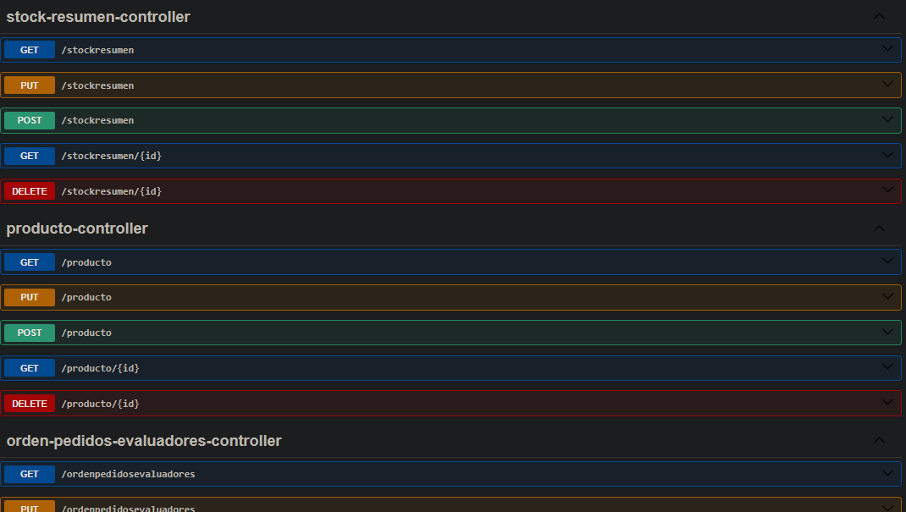
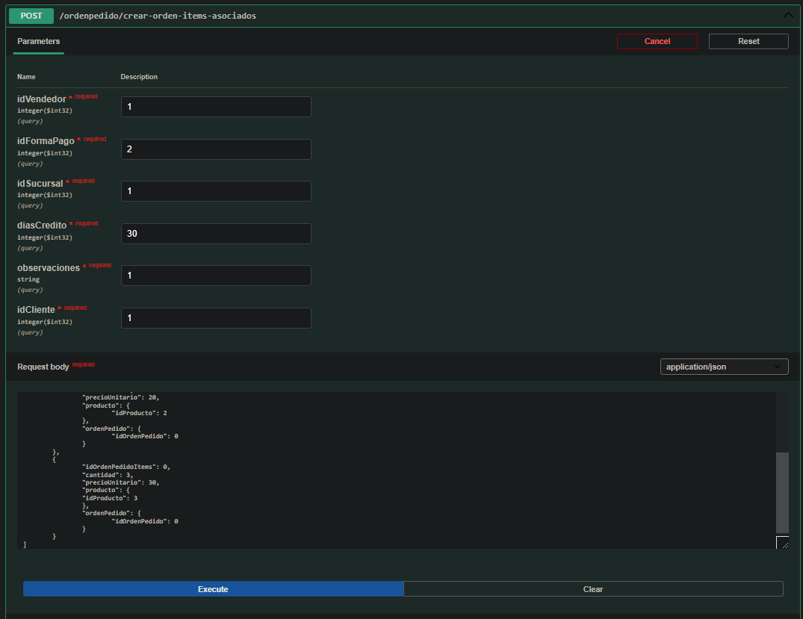
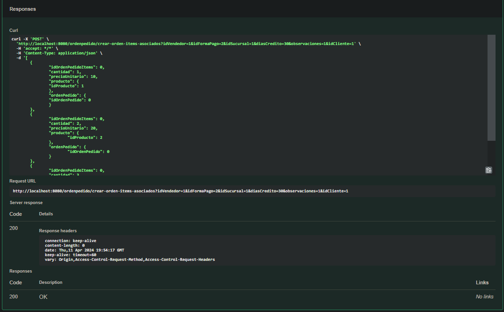
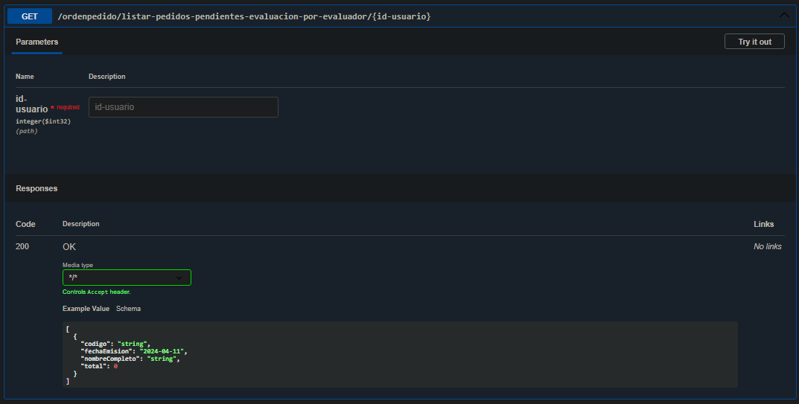
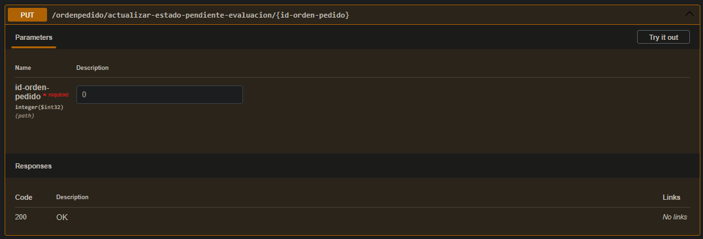
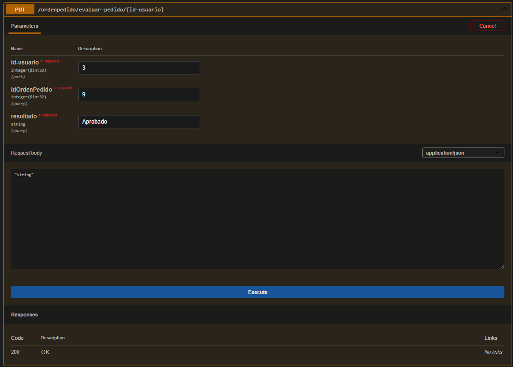

## Cómo empezar

1. Crear una base de datos local en PostgreSQL con el nombre `examen_practico_desarrollador_backend`
2. Añadir información de prueba y estados a la tabla EstadoPedido:

| ID | Descripcion          |
|----|----------------------|
| 1  | Borrador             |
| 2  | Pendiente Evaluacion |
| 3  | Aprobado             |
| 4  | Desaprobado          |

3. Actualizar las credenciales de la base de datos en el archivo `application.properties`:

```properties
spring.datasource.username=postgres
spring.datasource.password=xxxxxx
```

4. Actualizar las credenciales del correo electrónico en el archivo `application.properties`:

```properties
spring.mail.properties.mail.from=xxxxxx@gmail.com
spring.mail.username=xxxxxx@gmail.com
spring.mail.password=xxxxxx
```

## Capabilities

### CRUD de todas las 11 entidades



### Registrar una orden de pedido con items asociados




### Listar los pedidos pendientes de evaluación filtrando por el usuario evaluador



### Cambiar el estado de un pedido en Borrador a Pendiente Evaluacion



### Evaluar un pedido

